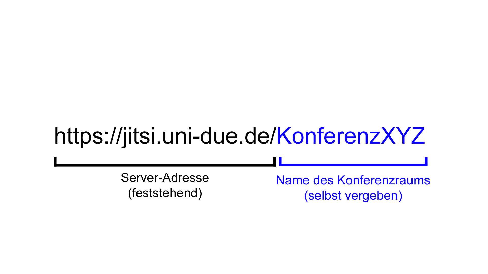

# Videokonferenzen in der Lehre

_Musikakademie der Stadt Kassel "Louis Spohr"_

_Felix Werthschulte, Dozent für Neue Medien_

---

## Worum geht es?

1. Einsatzszenarien
2. Was machen Videokonferenzen möglich?
3. Was benötigen Videokonferenzen?
4. Anbieter und Typen
5. Beispiel Jitsi
6. Tipps und Hinweise

---

## 1. Einsatzszenarien für Videokonferenzen

- Gruppenunterricht frontal
- Teamarbeit
- Einzelgespräche
- (gemeinsames) Musizieren
- Prüfungen

---

## 2. Was machen Videokonferenzen möglich?

- synchrones Lernen
- Kollaboration
- (Gefühl von) Nähe
- Kontrolle ("Proctoring")

---

## 3. Was benötigen Videokonferenzen?

- geeignete Hardware und Software
- Bandbreite
- Konzentration (siehe "Zoom-Fatigue")
- Vertrauen

---

## 4. Anbieter und Typen

- kommerziell
- nicht-kommerziell

---

## 4.1. Kommerzielle Anbieter

- Zoom
- Microsoft Teams
- Cisco WebEx
- Skype
- eigene Infrastruktur (Rechenzentren, Netzwerke, Software, Support)

---

## 4.1.1. Vorteile kommerzieller Anbieter

- Bekanntheit
- Stabilität, Verfügbarkeit
- (meistens) einfache Bedienung

---

## 4.2. Nicht-kommerzielle Anbieter

- Jitsi Meet ("Jitsi")
- BigBlueButton ("BBB")

---

## 4.2. Vorteile nicht-kommerzieller Anbieter

- Source-Code offen → Transparenz
- Diversität → viele Anbieter
- Datenschutz
- Bedienung per Browser → Einfachheit

---

## 5. Beispiel Jitsi

- open source
- Browser-basiert (Google Chrome, Opera, ggf. Firefox) oder [App](https://play.google.com/store/apps/details?id=org.jitsi.meet&hl=de_DE)
- viele Instanzen, u.a. von Unis, Vereinen, Privatpersonen
- Konferenzräume existieren "immer"

---

## 5.1. Vorgehen als Gastgeber*in

- Jitsi-Server auswählen
- URL weitergeben (z.B. meet.ffmuc.net/KonferenzraumXYZ)
- Konferenzraum eröffnen (belegen)
- Einstellungen vornehmen

---

## 5.2. Jitsi - Einladungslinks

---

## 5.3. Beispiele für freie Jitsi-Server

- [jitsi.uni-due.de](https://jitsi.uni-due.de)
- [meet.ffmuc.net](https://meet.ffmuc.net)
- [www.kuketz-meet.de](https://www.kuketz-meet.de)
- siehe auch die [Liste von Tobias Scheible](https://scheible.it/liste-mit-oeffentlichen-jitsi-meet-instanzen/)

---

## 6. Tipps und Hinweise 1

- gleichbleibende Adressen
- stumm geschaltet ≠ unhöflich
- Chatfunktion aktiv nutzen
- Bildschirm teilen

---

## 6. Tipps und Hinweise 2

- Kamera: so viel wie nötig, so wenig wie möglich
- Latenz-Leid
- Zählen "virtuelle Minuten" doppelt?
- Synchronität immer notwendig?
- Ersatz-Kanäle bereithalten/nutzen

---

# Vielen Dank!
